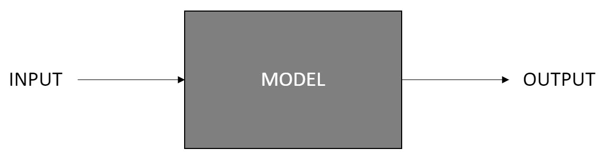
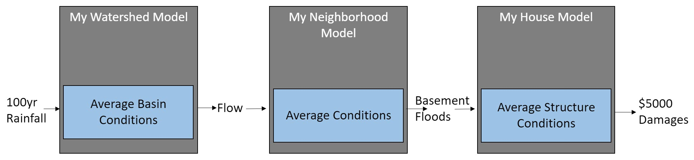
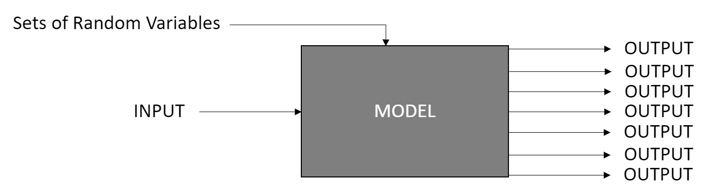
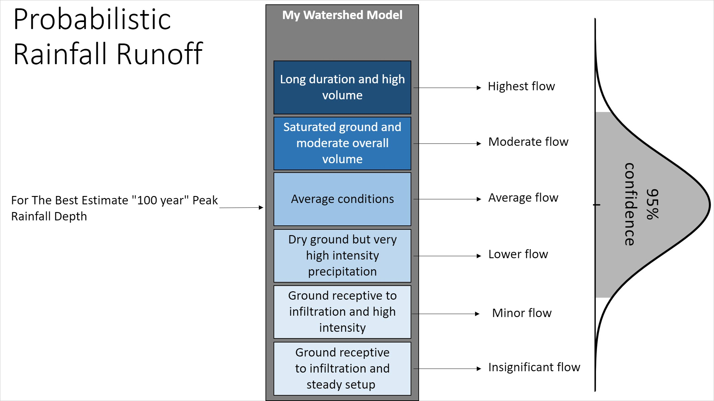
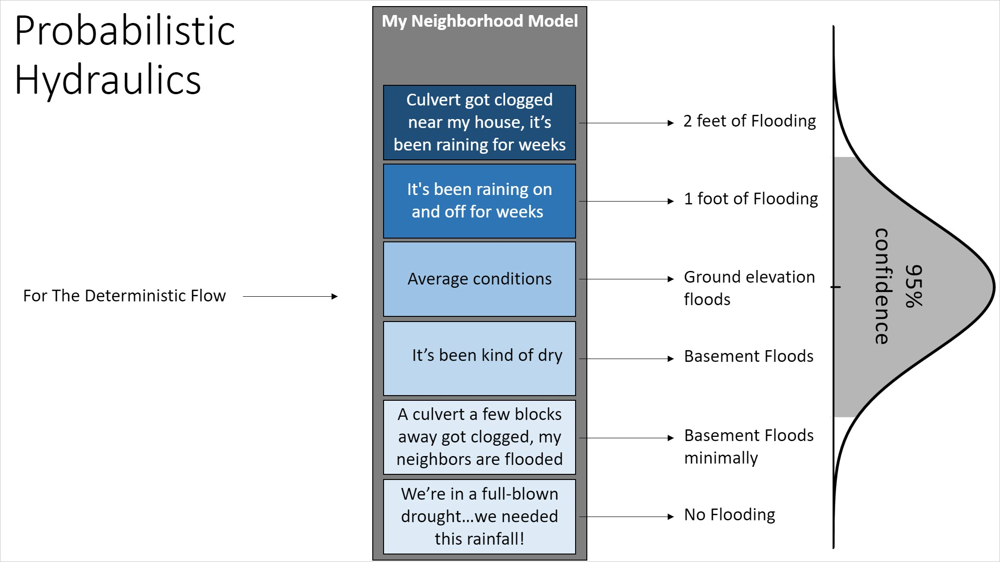
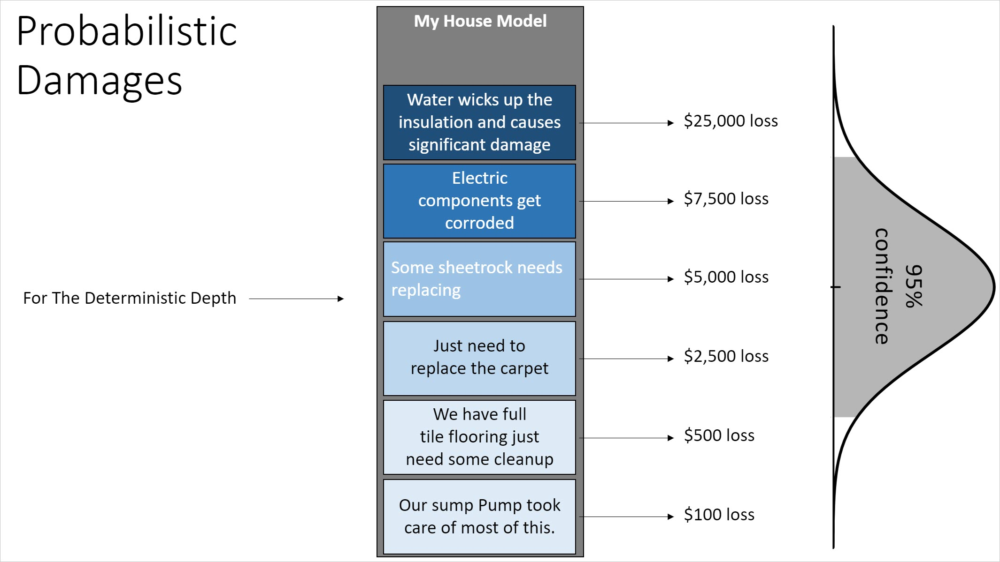
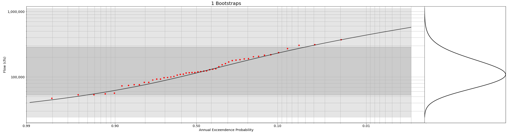
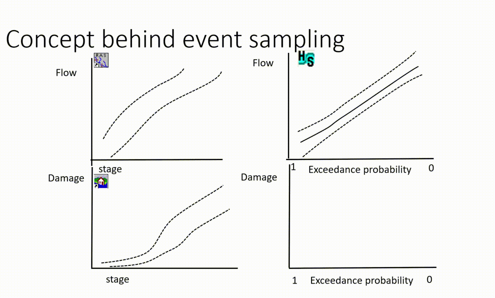

# asfpm2020-demo

## Deterministic
A deterministic system has no randomness at all, for a given input, there is a known output.

## An example Deterministic System
In this process for a 100 year precip (if we actually could say we knew what that was) we compute a flow (which is not likely to be the 100 year flow) which produces a stage, and then a damage...

## Probabilistic
A probabilistic system introduces randomness into the system by varying things like initial conditions, and as a comparitive definition to our deterministic definition: In a probabilistic system, for a given input and a set of random initial conditions, we produce a distribution of outputs. 

## An example Probabilistic System
This series of images helps to show more what a truthful representation of a system might be - firstly, for the same precipitation above, which we called the 100 year rainfall, we specifiy it as a given peak precip. We can talk more about what it might represent later, maybe we could say here "our best estimate peak 100 year precipitation..."

That precipitation as you might imagine above could realistically producs a range of flows. If we were to take the same flow as produced before in the deterministic model and imagine using a probabilistic model for the computation of stage (or water depth at a structure) we would see a range of depths because we dont really know the initial conditions or behaviors of the system.

As you see above, the deterministic flow could really produce a range of depths at the structure, if we were to take that same deterministic depth and compute a probabilistic damage, we see there could really be a range of damages because we dont really know everything about what would result in damages in an "average" house.

## Getting back to that "we dont really know the 100 year flow" bit...
Examples in Jupyter Notebooks for how we can use bootstrapping methods used in Probabilistic Flood Hazards Studies to express our limited knowledge due to limited observations:

# Combining It all together with Event Sampling and Monte Carlo
You might be wondering, how do we get this right? There are so many possible outcomes, how can we combine this correctly? The answer is simple, composition of functions with Riemann Integration obviously... (mathematicians think they are cool). The common language for this is A Systems Event Based Monte Carlo. 

In this type of modeling framework, a series of deterministic runs, each with a randomized initial condition (which can be correlated or the same across models e.g. starting pool in the reservoirs if they are represented in many models) with each simulated event within a realization we are evaluating natural variability, with each realization we are evaluating our knowledge uncertainties. This gives us the ability to express our inability to know,and the natural variability of our sytems and combine the models into a singular system model that can support decision making.
