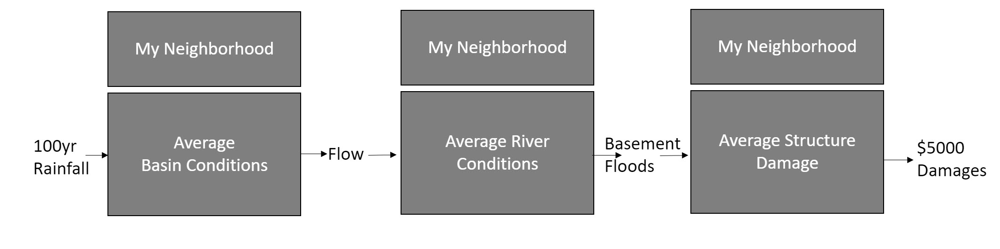
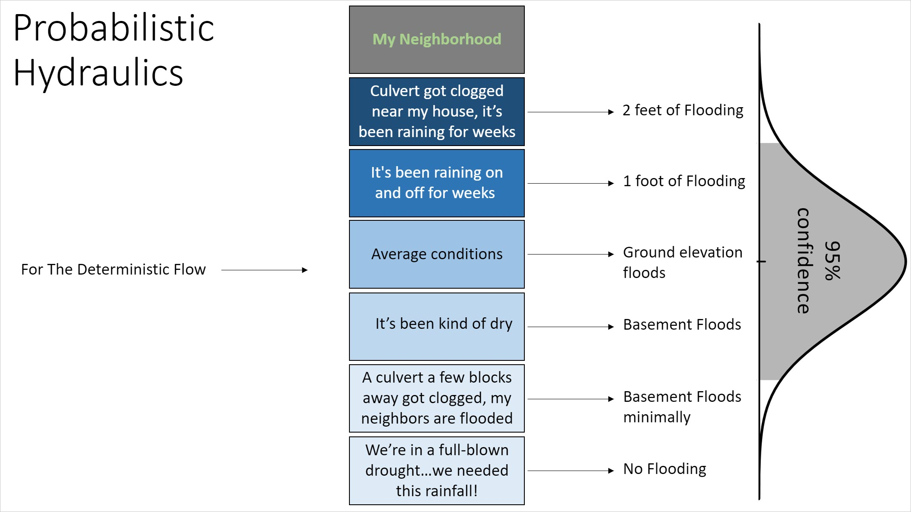
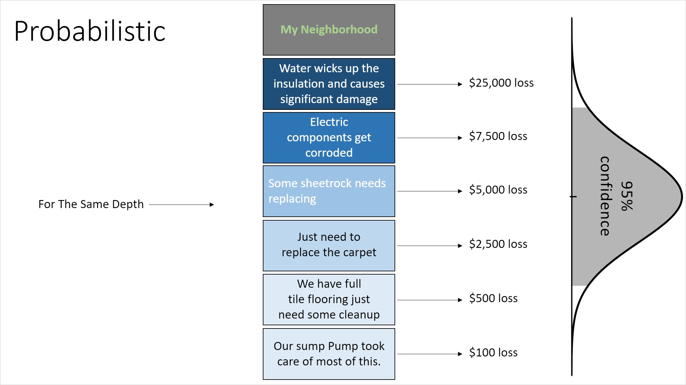

# asfpm2020-demo

Examples in Jupyter Notebooks for  methods used in Probabilistic Flood Hazards Studies

## Deterministic
A deterministic system has no randomness at all, for a given input, there is a known output.

## An example Deterministic System
In this process for a 100 year precip (if we actually could say we knew what that was) we compute a flow (which is not likely to be the 100 year flow) which produces a stage, and then a damage...

## Probabilistic
A probabilistic system introduces randomness into the system, for a given input and a set of random initial conditions we produce a distribution of outputs. 

## An example Probabilistic System

