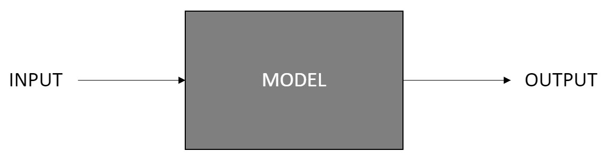
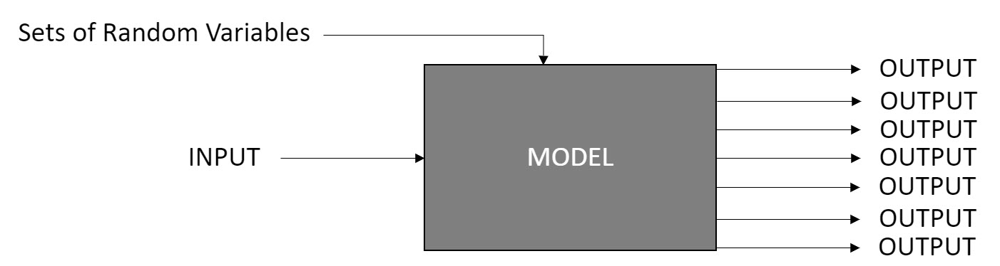
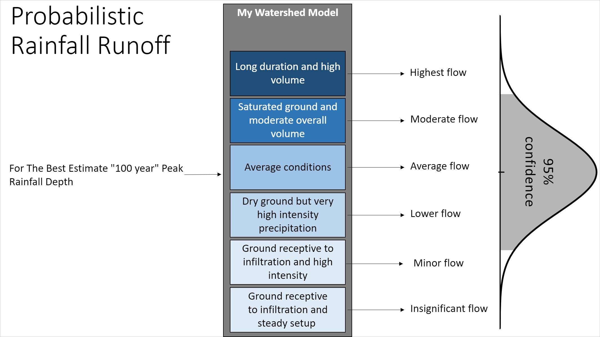
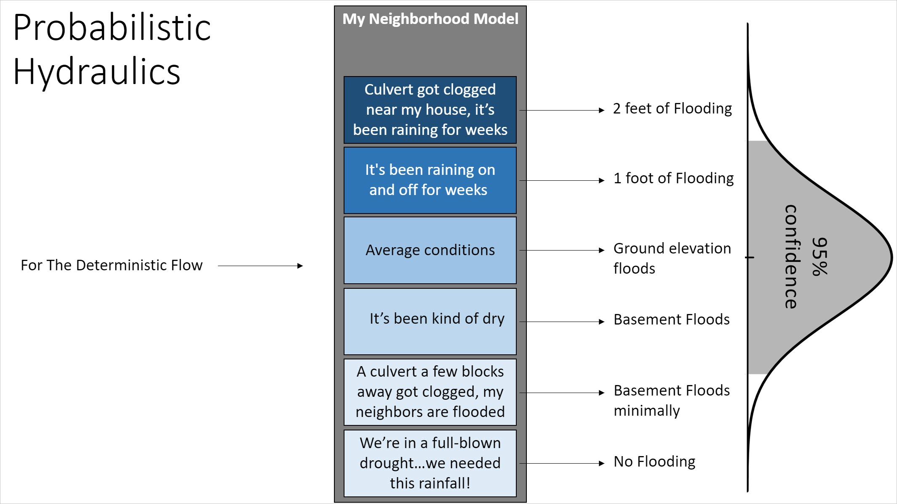
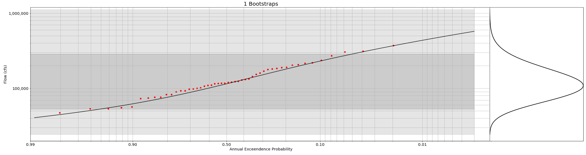
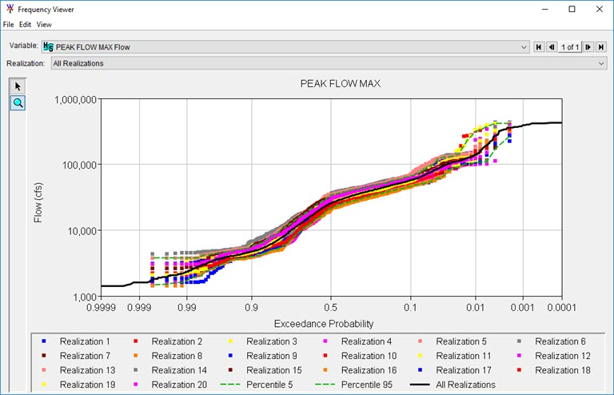

# Probabilistic Flood Risk Analysis to Support Risk Informed Decision-Making

## ASFPM 2020

#### Track: Risk Comm
#### B5: Risk-Informed Decision Making

Seth Lawler, Dewberry

Will Lehman, USACE

---

## Objectives

- Discuss Deterministic and Probabilistic Systems
- Discuss the limits of what we can claim to know
- Discuss how we can make decisions inlight of not knowing something now or in the future

## Deterministic
A deterministic system has no randomness at all, for a given input, there is a known output.

## An example Deterministic System
In this process for a 100 year precip (if we actually could say we knew what that was) we compute a flow (which is not likely to be the 100 year flow) which produces a stage, and then a damage...

## Probabilistic
A probabilistic system introduces randomness into the system by varying things like initial conditions, and as a comparitive definition to our deterministic definition: In a probabilistic system, for a given input and a set of random initial conditions, we produce a distribution of outputs. 

## An example Probabilistic System

### Rainfall Runoff

This series of images helps to show more what a truthful representation of a system might be - firstly, for the same precipitation above, which we called the 100 year rainfall, we specifiy it as a given peak precip. We can talk more about what it might represent later, maybe we could say here "our best estimate peak 100 year precipitation..."

### Hydraulics

That precipitation as you might imagine above could realistically producs a range of flows. If we were to take the same flow as produced before in the deterministic model and imagine using a probabilistic model for the computation of stage (or water depth at a structure) we would see a range of depths because we dont really know the initial conditions or behaviors of the system.

### Damages

As you see above, the deterministic flow could really produce a range of depths at the structure, if we were to take that same deterministic depth and compute a probabilistic damage, we see there could really be a range of damages because we dont really know everything about what would result in damages in an "average" house.

## Getting back to that "we dont really know the 100 year flow" bit...
Examples in Jupyter Notebooks for how we can use bootstrapping methods used in Probabilistic Flood Hazards Studies to express our limited knowledge due to limited observations:

[The master Notebook](https://mybinder.org/v2/gh/Dewberry/asfpm2020-demo/master)

# Combining It all together with Event Sampling and Monte Carlo
You might be wondering, how do we get this right? There are so many possible outcomes, how can we combine this correctly? The answer is simple, composition of functions with Riemann Integration obviously... (mathematicians think they are cool). The common language for this is A Systems Event Based Monte Carlo. 

In this type of modeling framework, a series of deterministic runs, each with a randomized initial condition (which can be correlated or the same across models e.g. starting pool in the reservoirs if they are represented in many models) with each simulated event within a realization we are evaluating natural variability, with each realization we are evaluating our knowledge uncertainties. This gives us the ability to express our inability to know,and the natural variability of our sytems and combine the models into a singular system model that can support decision making.

Through this type of modeling each event is equally likely to occur, so the resulting floodplains and damages can be utilized to describe the distribution of expected losses through simple computations like the one shown above.

# An Example Study

## Study Area
In this example, we had a study area on a regulated river with a levee providing risk mitigation to an area with many buildings. The area had two locations that were modeled as likely breach locations (these are signified by the yellow dots in the image below). The breach locations included fragility curves to describe the likelihood that the levee might breach when loaded. These were one of the initial conditions sampled within the hydrauilcs model. We computed 10,000 events using HEC-WAT with the Hydrologic Sampler, HEC-RAS, the Fragility Curve Sampler, a consequence engine, and the AEP_Grid to produce the results shown in the images that follow.

## Representing the Natural Variability and Knowledge Uncertainty in Flow

An empirical frequency curve with uncertainty was developed and utilized to describe the flow in the river and how the regulation of the upstream dam impacts the flow boundary condition. A few historic shapesets were leveraged for scaling the flod hydrograph. As you can see here we have 20 realizations of 500 events each to construct the 10,000 events. This allows us to compute 20 different estimates (one for each realization) for any of our decision metrics. 

## Summarizing Hydraulics Output
It can be quite complicated to manage the volume of data produced by large scale Monte Carlo modeling. To facilitate communication, minimize data storage, and to enhance reproducability we have constructed some useful tools to support the summarization of hydraulic results.

### Times Wet Grid
As we showed in the images above, we can create a summary grid from each sampled event to produce a database that stores how many times a gridcell gets depth above ground. The image below is a map that represents that database. As you can see, there is variation in the number of times the cells behind a levee get wet. This is due to the presence or absence of a breach, which location breached, if one breached before the other, the peak flow, the shape of the hydrograph, topographical relief, and many other conditions governing the way flow gets converted into depth. Even though the levee may have a specified overtopping frequency for its design, all cells within the leveed area will not necessarily get wet the same number of times, that depends on the characteristics of the events themselves. One of these grids can be created based off of a summary of all of the realizations (representing our best estimate) and for each realization independantly giving us the abiilty to express our uncertainty in how many times a cell might get wet.

### Annual Exceedance Probability Grid
This grid can be easily converted into an Annual Exceedance Probability grid by simply dividing by the number of events that were used to create it. in out case there were 10,000 events. The cells now represent a likelihood of getting water above the ground elevation. Similar grids can be constructed from any sort of output parameter and threshold criteria (e.g. a Annual Velocity Exceedance Grid which represents likelihood of Velocity over some threshold). 

Like the previous summary grid we could create a singular representation (like the one presented above) showing our best guess at the likelihood of a cell getting wet, or we could create 20 different grids and summarize the variation in estimates at each cell as a distribution of Expected Annual Exceedance Probabilities.

### Annual Exceedance Probability at a building 
Another interesting view of the hydrauilcs results across a floodplain is a desription of the count of times a structure gets wet. In this case we tracked depth above ground, but the depth above first floor elevation (unique to each structure) could just as easily be tracked. These could be displayed as our best estimate of the likelihood of the ground around a home getting wet, or a distribution of the likelihoods (based on a summary of the 20 realizations) a structure gets wet.

## Summarizing Economic Damages
During the Monte Carlo process many variables are unknown in how much damage may happen for a given depth at the structure. These are sampled with each event and summarized into an Expected Annual Damage at each structure. The summary is simply computing the average damage. As described with the other outputs we can describe a distribution of the Expected Annual Damages for each structure which represents our inability to "know" what the true expected annual damage at a structure will be. 

